# タスク管理アプリケーション 設計書

## 目次

1. [テーブル設計書](#1-テーブル設計書)
2. [画面設計書](#2-画面設計書)
3. [API設計書](#3-api設計書)

---

## 1. テーブル設計書

### 1.1 テーブル一覧

| No. | テーブル名 | 論理名 | 概要 |
|-----|-----------|--------|------|
| 1 | users | ユーザー | アプリケーション利用者情報を管理する |
| 2 | tasks | タスク | タスク情報を管理する |
| 3 | comments | コメント | タスクに対するコメントを管理する |

### 1.2 テーブル定義

#### 1.2.1 users（ユーザー）

| No. | カラム名 | 論理名 | データ型 | PK | NOT NULL | デフォルト | 備考 |
|-----|---------|--------|---------|-----|----------|-----------|------|
| 1 | id | ユーザーID | BIGINT (AUTO_INCREMENT) | ○ | ○ | - | |
| 2 | username | ユーザー名 | VARCHAR(100) | | ○ | - | ユニーク制約 |
| 3 | email | メールアドレス | VARCHAR(255) | | ○ | - | ユニーク制約 |
| 4 | password_hash | パスワードハッシュ | VARCHAR(255) | | ○ | - | bcrypt等でハッシュ化 |
| 5 | created_at | 作成日時 | TIMESTAMP | | ○ | CURRENT_TIMESTAMP | |
| 6 | updated_at | 更新日時 | TIMESTAMP | | ○ | CURRENT_TIMESTAMP | 更新時自動更新 |

**インデックス：**
- `idx_users_username` : `username`（UNIQUE）
- `idx_users_email` : `email`（UNIQUE）

#### 1.2.2 tasks（タスク）

| No. | カラム名 | 論理名 | データ型 | PK | NOT NULL | デフォルト | 備考 |
|-----|---------|--------|---------|-----|----------|-----------|------|
| 1 | id | タスクID | BIGINT (AUTO_INCREMENT) | ○ | ○ | - | |
| 2 | title | タイトル | VARCHAR(255) | | ○ | - | 最大255文字 |
| 3 | description | 説明 | TEXT | | | NULL | |
| 4 | status | ステータス | ENUM('todo','in_progress','done') | | ○ | 'todo' | |
| 5 | due_date | 期限 | DATE | | | NULL | |
| 6 | created_by | 作成者ID | BIGINT | | ○ | - | FK → users.id |
| 7 | created_at | 作成日時 | TIMESTAMP | | ○ | CURRENT_TIMESTAMP | |
| 8 | updated_at | 更新日時 | TIMESTAMP | | ○ | CURRENT_TIMESTAMP | 更新時自動更新 |

**インデックス：**
- `idx_tasks_status` : `status`
- `idx_tasks_created_by` : `created_by`
- `idx_tasks_due_date` : `due_date`

**外部キー：**
- `fk_tasks_created_by` : `created_by` → `users(id)` ON DELETE RESTRICT

#### 1.2.3 comments（コメント）

| No. | カラム名 | 論理名 | データ型 | PK | NOT NULL | デフォルト | 備考 |
|-----|---------|--------|---------|-----|----------|-----------|------|
| 1 | id | コメントID | BIGINT (AUTO_INCREMENT) | ○ | ○ | - | |
| 2 | task_id | タスクID | BIGINT | | ○ | - | FK → tasks.id |
| 3 | user_id | 投稿者ID | BIGINT | | ○ | - | FK → users.id |
| 4 | body | コメント本文 | TEXT | | ○ | - | |
| 5 | created_at | 投稿日時 | TIMESTAMP | | ○ | CURRENT_TIMESTAMP | |
| 6 | updated_at | 更新日時 | TIMESTAMP | | ○ | CURRENT_TIMESTAMP | 更新時自動更新 |

**インデックス：**
- `idx_comments_task_id` : `task_id`
- `idx_comments_user_id` : `user_id`

**外部キー：**
- `fk_comments_task_id` : `task_id` → `tasks(id)` ON DELETE CASCADE
- `fk_comments_user_id` : `user_id` → `users(id)` ON DELETE RESTRICT

### 1.3 ER図

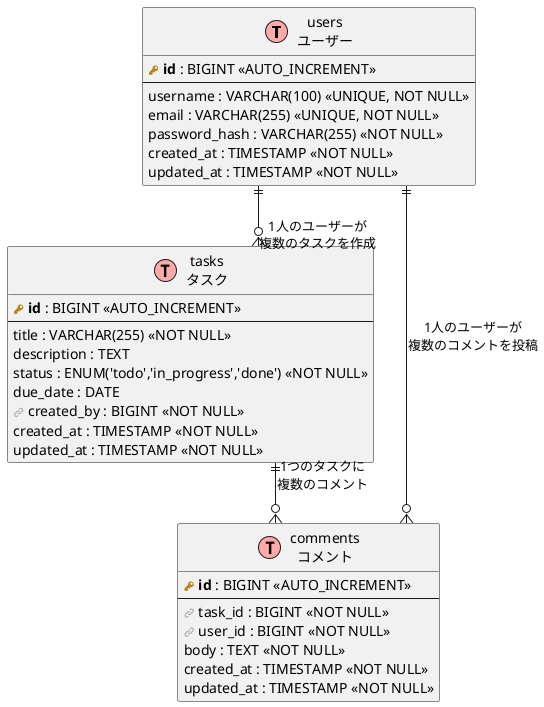

---

## 2. 画面設計書

### 2.1 画面一覧

| No. | 画面ID | 画面名 | URL | 概要 |
|-----|--------|--------|-----|------|
| 1 | SCR-001 | ログイン画面 | `/login` | ユーザー認証を行う |
| 2 | SCR-002 | タスク一覧画面 | `/tasks` | タスクの一覧を表示する |
| 3 | SCR-003 | タスク作成画面 | `/tasks/new` | 新規タスクを作成する |
| 4 | SCR-004 | タスク詳細画面 | `/tasks/:id` | タスクの詳細情報とコメントを表示する |
| 5 | SCR-005 | タスク編集画面 | `/tasks/:id/edit` | タスクの情報を編集する |

### 2.2 画面遷移図

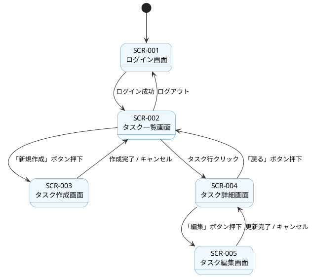

### 2.3 画面レイアウト

#### 2.3.1 SCR-001 ログイン画面

**概要：** ユーザーがメールアドレスとパスワードでログインする。

| No. | 要素 | 種類 | 必須 | バリデーション |
|-----|------|------|------|--------------|
| 1 | メールアドレス | テキスト入力 | ○ | メール形式チェック |
| 2 | パスワード | パスワード入力 | ○ | 1文字以上 |
| 3 | ログインボタン | ボタン | - | - |

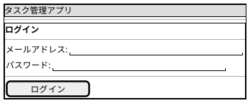

#### 2.3.2 SCR-002 タスク一覧画面

**概要：** 全タスクを一覧表示する。ステータスでフィルタリングが可能。

| No. | 要素 | 種類 | 必須 | バリデーション |
|-----|------|------|------|--------------|
| 1 | ステータスフィルタ | ドロップダウン | - | - |
| 2 | タスク一覧テーブル | テーブル | - | - |
| 3 | 新規作成ボタン | ボタン | - | - |
| 4 | ログアウトボタン | ボタン | - | - |

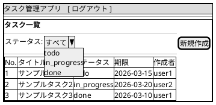

#### 2.3.3 SCR-003 タスク作成画面

**概要：** 新しいタスクを作成する。

| No. | 要素 | 種類 | 必須 | バリデーション |
|-----|------|------|------|--------------|
| 1 | タイトル | テキスト入力 | ○ | 1〜255文字 |
| 2 | 説明 | テキストエリア | - | - |
| 3 | 期限 | 日付入力 | - | 過去日不可 |
| 4 | 作成ボタン | ボタン | - | - |
| 5 | キャンセルボタン | ボタン | - | - |

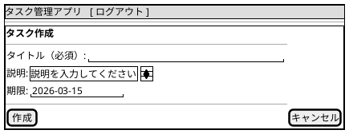

#### 2.3.4 SCR-004 タスク詳細画面

**概要：** タスクの詳細情報を表示し、ステータスの変更やコメントの投稿・編集・削除を行う。

| No. | 要素 | 種類 | 必須 | バリデーション |
|-----|------|------|------|--------------|
| 1 | タスク情報表示 | 表示エリア | - | - |
| 2 | ステータス変更 | ドロップダウン | - | - |
| 3 | 編集ボタン | ボタン | - | - |
| 4 | 戻るボタン | ボタン | - | - |
| 5 | コメント一覧 | リスト | - | - |
| 6 | コメント入力 | テキストエリア | ○（投稿時） | 1文字以上 |
| 7 | コメント投稿ボタン | ボタン | - | - |

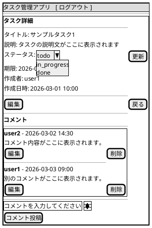

#### 2.3.5 SCR-005 タスク編集画面

**概要：** タスクのタイトルと説明を編集する。

| No. | 要素 | 種類 | 必須 | バリデーション |
|-----|------|------|------|--------------|
| 1 | タイトル | テキスト入力 | ○ | 1〜255文字 |
| 2 | 説明 | テキストエリア | - | - |
| 3 | 更新ボタン | ボタン | - | - |
| 4 | キャンセルボタン | ボタン | - | - |

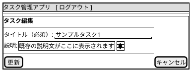

---

## 3. API設計書

### 3.1 API一覧

| No. | メソッド | エンドポイント | 概要 |
|-----|---------|--------------|------|
| 1 | POST | `/api/auth/login` | ログイン |
| 2 | POST | `/api/auth/logout` | ログアウト |
| 3 | GET | `/api/tasks` | タスク一覧取得 |
| 4 | POST | `/api/tasks` | タスク作成 |
| 5 | GET | `/api/tasks/:id` | タスク詳細取得 |
| 6 | PUT | `/api/tasks/:id` | タスク更新 |
| 7 | PATCH | `/api/tasks/:id/status` | タスクステータス変更 |
| 8 | GET | `/api/tasks/:id/comments` | コメント一覧取得 |
| 9 | POST | `/api/tasks/:id/comments` | コメント投稿 |
| 10 | PUT | `/api/tasks/:id/comments/:commentId` | コメント編集 |
| 11 | DELETE | `/api/tasks/:id/comments/:commentId` | コメント削除 |

### 3.2 API詳細

#### 3.2.1 POST `/api/auth/login` - ログイン

**リクエスト：**

```json
{
  "email": "user@example.com",
  "password": "password123"
}
```

| パラメータ | 型 | 必須 | バリデーション |
|-----------|-----|------|--------------|
| email | string | ○ | メール形式 |
| password | string | ○ | 1文字以上 |

**レスポンス（200 OK）：**

```json
{
  "token": "eyJhbGciOiJIUzI1NiIs...",
  "user": {
    "id": 1,
    "username": "user1",
    "email": "user@example.com"
  }
}
```

**エラーレスポンス（401 Unauthorized）：**

```json
{
  "error": "メールアドレスまたはパスワードが正しくありません"
}
```

#### 3.2.2 POST `/api/auth/logout` - ログアウト

**リクエスト：** なし（認証ヘッダーのみ）

**レスポンス（200 OK）：**

```json
{
  "message": "ログアウトしました"
}
```

#### 3.2.3 GET `/api/tasks` - タスク一覧取得

**クエリパラメータ：**

| パラメータ | 型 | 必須 | 説明 |
|-----------|-----|------|------|
| status | string | - | ステータスでフィルタ（`todo`, `in_progress`, `done`） |

**レスポンス（200 OK）：**

```json
{
  "tasks": [
    {
      "id": 1,
      "title": "サンプルタスク1",
      "description": "タスクの説明",
      "status": "todo",
      "due_date": "2026-03-15",
      "created_by": {
        "id": 1,
        "username": "user1"
      },
      "created_at": "2026-03-01T10:00:00Z",
      "updated_at": "2026-03-01T10:00:00Z"
    }
  ]
}
```

#### 3.2.4 POST `/api/tasks` - タスク作成

**リクエスト：**

```json
{
  "title": "新しいタスク",
  "description": "タスクの詳細説明",
  "due_date": "2026-03-15"
}
```

| パラメータ | 型 | 必須 | バリデーション |
|-----------|-----|------|--------------|
| title | string | ○ | 1〜255文字 |
| description | string | - | - |
| due_date | string (YYYY-MM-DD) | - | 過去日不可 |

**レスポンス（201 Created）：**

```json
{
  "id": 2,
  "title": "新しいタスク",
  "description": "タスクの詳細説明",
  "status": "todo",
  "due_date": "2026-03-15",
  "created_by": {
    "id": 1,
    "username": "user1"
  },
  "created_at": "2026-03-10T10:00:00Z",
  "updated_at": "2026-03-10T10:00:00Z"
}
```

**エラーレスポンス（400 Bad Request）：**

```json
{
  "errors": [
    { "field": "title", "message": "タイトルは必須です" }
  ]
}
```

#### 3.2.5 GET `/api/tasks/:id` - タスク詳細取得

**パスパラメータ：**

| パラメータ | 型 | 必須 | 説明 |
|-----------|-----|------|------|
| id | integer | ○ | タスクID |

**レスポンス（200 OK）：**

```json
{
  "id": 1,
  "title": "サンプルタスク1",
  "description": "タスクの説明",
  "status": "todo",
  "due_date": "2026-03-15",
  "created_by": {
    "id": 1,
    "username": "user1"
  },
  "created_at": "2026-03-01T10:00:00Z",
  "updated_at": "2026-03-01T10:00:00Z"
}
```

**エラーレスポンス（404 Not Found）：**

```json
{
  "error": "タスクが見つかりません"
}
```

#### 3.2.6 PUT `/api/tasks/:id` - タスク更新

**リクエスト：**

```json
{
  "title": "更新後のタイトル",
  "description": "更新後の説明"
}
```

| パラメータ | 型 | 必須 | バリデーション |
|-----------|-----|------|--------------|
| title | string | ○ | 1〜255文字 |
| description | string | - | - |

**レスポンス（200 OK）：**

```json
{
  "id": 1,
  "title": "更新後のタイトル",
  "description": "更新後の説明",
  "status": "todo",
  "due_date": "2026-03-15",
  "created_by": {
    "id": 1,
    "username": "user1"
  },
  "created_at": "2026-03-01T10:00:00Z",
  "updated_at": "2026-03-10T11:00:00Z"
}
```

#### 3.2.7 PATCH `/api/tasks/:id/status` - タスクステータス変更

**リクエスト：**

```json
{
  "status": "in_progress"
}
```

| パラメータ | 型 | 必須 | バリデーション |
|-----------|-----|------|--------------|
| status | string | ○ | `todo`, `in_progress`, `done` のいずれか |

**レスポンス（200 OK）：**

```json
{
  "id": 1,
  "title": "サンプルタスク1",
  "description": "タスクの説明",
  "status": "in_progress",
  "due_date": "2026-03-15",
  "created_by": {
    "id": 1,
    "username": "user1"
  },
  "created_at": "2026-03-01T10:00:00Z",
  "updated_at": "2026-03-10T12:00:00Z"
}
```

**エラーレスポンス（400 Bad Request）：**

```json
{
  "errors": [
    { "field": "status", "message": "ステータスは todo, in_progress, done のいずれかを指定してください" }
  ]
}
```

#### 3.2.8 GET `/api/tasks/:id/comments` - コメント一覧取得

**パスパラメータ：**

| パラメータ | 型 | 必須 | 説明 |
|-----------|-----|------|------|
| id | integer | ○ | タスクID |

**レスポンス（200 OK）：**

```json
{
  "comments": [
    {
      "id": 1,
      "task_id": 1,
      "user": {
        "id": 2,
        "username": "user2"
      },
      "body": "コメント内容",
      "created_at": "2026-03-02T14:30:00Z",
      "updated_at": "2026-03-02T14:30:00Z"
    }
  ]
}
```

#### 3.2.9 POST `/api/tasks/:id/comments` - コメント投稿

**リクエスト：**

```json
{
  "body": "新しいコメント"
}
```

| パラメータ | 型 | 必須 | バリデーション |
|-----------|-----|------|--------------|
| body | string | ○ | 1文字以上 |

**レスポンス（201 Created）：**

```json
{
  "id": 3,
  "task_id": 1,
  "user": {
    "id": 1,
    "username": "user1"
  },
  "body": "新しいコメント",
  "created_at": "2026-03-10T13:00:00Z",
  "updated_at": "2026-03-10T13:00:00Z"
}
```

**エラーレスポンス（400 Bad Request）：**

```json
{
  "errors": [
    { "field": "body", "message": "コメント本文は必須です" }
  ]
}
```

#### 3.2.10 PUT `/api/tasks/:id/comments/:commentId` - コメント編集

**パスパラメータ：**

| パラメータ | 型 | 必須 | 説明 |
|-----------|-----|------|------|
| id | integer | ○ | タスクID |
| commentId | integer | ○ | コメントID |

**リクエスト：**

```json
{
  "body": "編集後のコメント"
}
```

| パラメータ | 型 | 必須 | バリデーション |
|-----------|-----|------|--------------|
| body | string | ○ | 1文字以上 |

**レスポンス（200 OK）：**

```json
{
  "id": 1,
  "task_id": 1,
  "user": {
    "id": 2,
    "username": "user2"
  },
  "body": "編集後のコメント",
  "created_at": "2026-03-02T14:30:00Z",
  "updated_at": "2026-03-10T14:00:00Z"
}
```

**エラーレスポンス（403 Forbidden）：**

```json
{
  "error": "このコメントを編集する権限がありません"
}
```

#### 3.2.11 DELETE `/api/tasks/:id/comments/:commentId` - コメント削除

**パスパラメータ：**

| パラメータ | 型 | 必須 | 説明 |
|-----------|-----|------|------|
| id | integer | ○ | タスクID |
| commentId | integer | ○ | コメントID |

**レスポンス（204 No Content）：** レスポンスボディなし

**エラーレスポンス（403 Forbidden）：**

```json
{
  "error": "このコメントを削除する権限がありません"
}
```

### 3.3 共通仕様

#### 3.3.1 認証

- ログインAPI以外のすべてのAPIは認証が必要。
- 認証はJWTトークンをAuthorizationヘッダーに付与する方式。

```
Authorization: Bearer <token>
```

**認証エラーレスポンス（401 Unauthorized）：**

```json
{
  "error": "認証が必要です"
}
```

#### 3.3.2 共通エラーレスポンス

| ステータスコード | 説明 |
|---------------|------|
| 400 | バリデーションエラー |
| 401 | 認証エラー |
| 403 | 権限エラー |
| 404 | リソース未検出 |
| 500 | サーバー内部エラー |

**500 Internal Server Error：**

```json
{
  "error": "サーバー内部エラーが発生しました"
}
```

### 3.4 シーケンス図

#### 3.4.1 タスク作成フロー

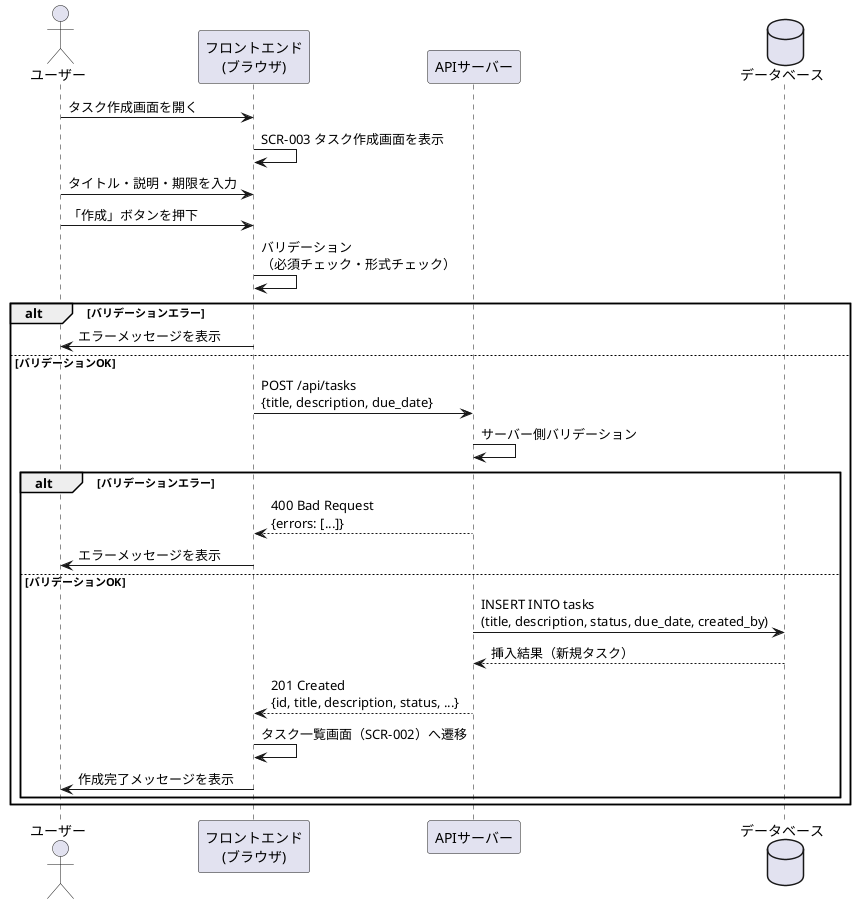

#### 3.4.2 タスクステータス変更フロー

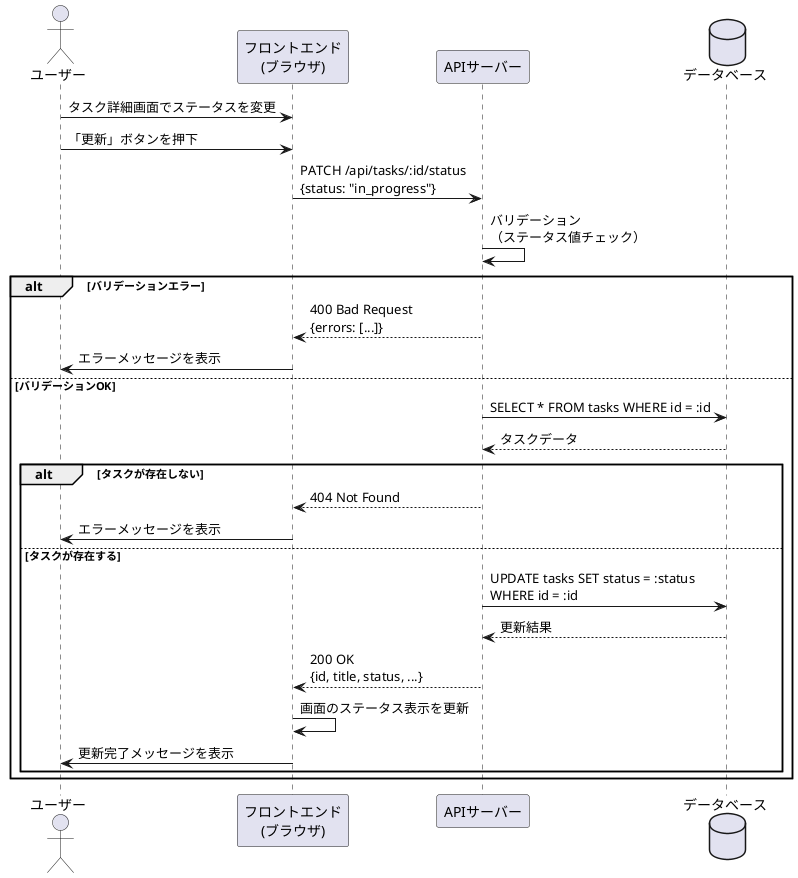

#### 3.4.3 コメント投稿フロー

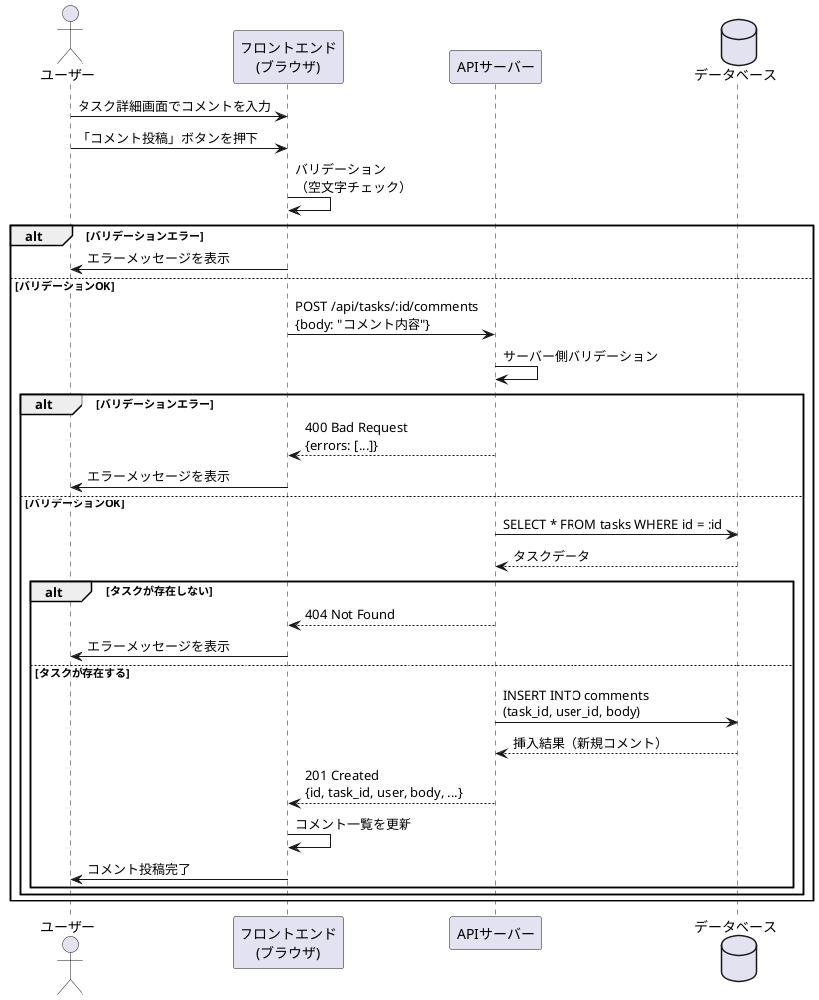

#### 3.4.4 コメント編集・削除フロー

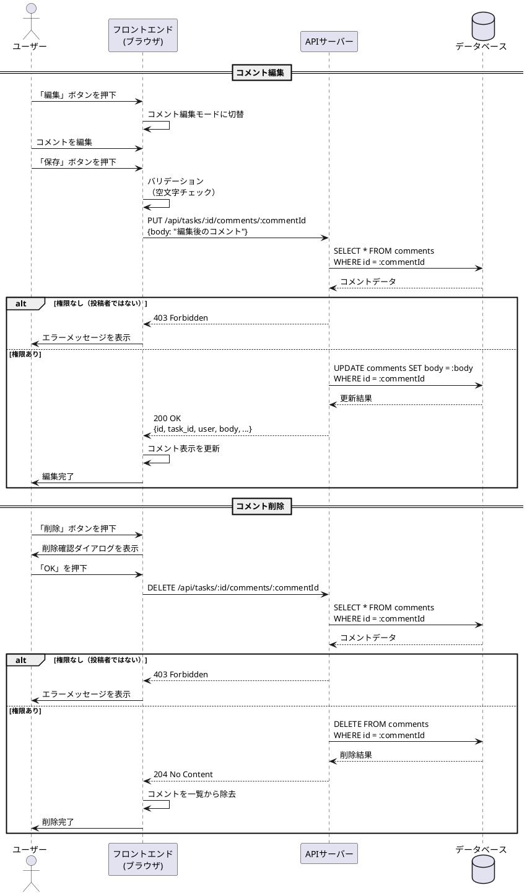

#### 3.4.5 ログインフロー

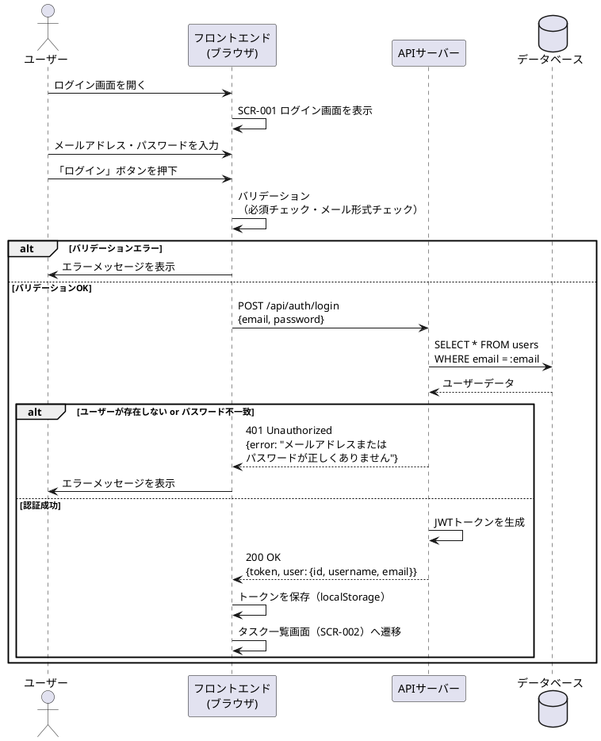
