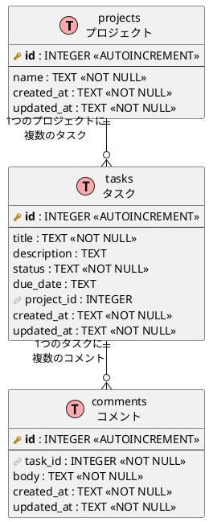
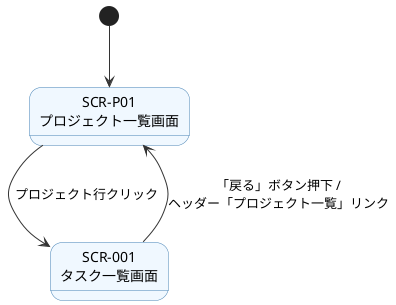
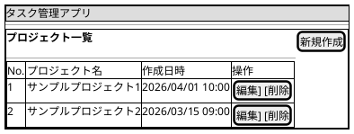
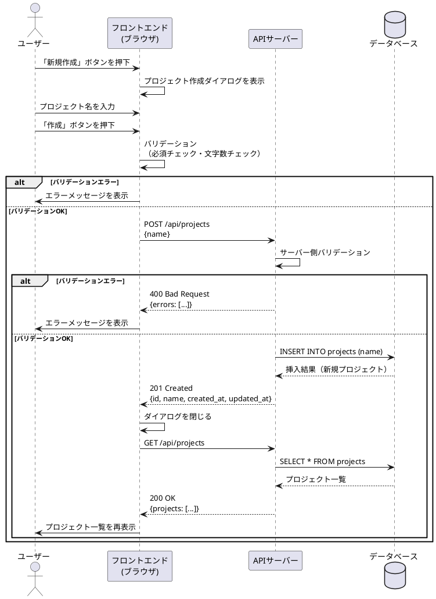
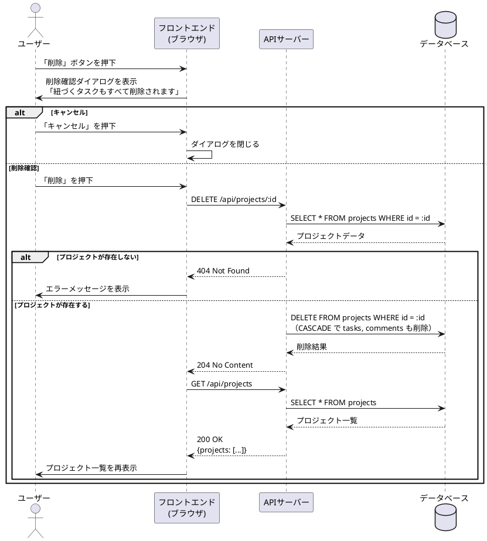

# プロジェクト機能 設計書

## 目次

1. [テーブル設計書](#1-テーブル設計書)
2. [画面設計書](#2-画面設計書)
3. [API設計書](#3-api設計書)

---

## 1. テーブル設計書

### 1.1 テーブル定義

#### projects（プロジェクト）

| No. | カラム名 | 論理名 | データ型 | PK | NOT NULL | デフォルト | 備考 |
|-----|---------|--------|---------|-----|----------|-----------|------|
| 1 | id | プロジェクトID | INTEGER (AUTOINCREMENT) | ○ | ○ | - | |
| 2 | name | プロジェクト名 | TEXT | | ○ | - | 最大255文字 |
| 3 | created_at | 作成日時 | TEXT | | ○ | datetime('now') | |
| 4 | updated_at | 更新日時 | TEXT | | ○ | datetime('now') | 更新時自動更新 |

### 1.2 リレーション

- `tasks.project_id` → `projects.id`（ON DELETE CASCADE）
- プロジェクト削除時、紐づくタスクおよびそのコメントもすべて削除される

### 1.3 ER図



---

## 2. 画面設計書

### 2.1 画面一覧

| No. | 画面ID | 画面名 | URL | 概要 |
|-----|--------|--------|-----|------|
| 1 | SCR-P01 | プロジェクト一覧画面 | `/projects` | プロジェクトの一覧表示・作成・編集・削除を行う |

### 2.2 画面遷移図



### 2.3 画面レイアウト

#### 2.3.1 SCR-P01 プロジェクト一覧画面

**概要：** 全プロジェクトを一覧表示する。モーダルダイアログで作成・編集を行う。

| No. | 要素 | 種類 | 必須 | バリデーション |
|-----|------|------|------|--------------|
| 1 | プロジェクト一覧テーブル | テーブル | - | - |
| 2 | 新規作成ボタン | ボタン | - | - |
| 3 | 編集ボタン（各行） | ボタン | - | - |
| 4 | 削除ボタン（各行） | ボタン | - | - |
| 5 | プロジェクト作成/編集ダイアログ | モーダル | - | - |
| 6 | 削除確認ダイアログ | モーダル | - | - |

**プロジェクト作成/編集ダイアログ：**

| No. | 要素 | 種類 | 必須 | バリデーション |
|-----|------|------|------|--------------|
| 1 | プロジェクト名 | テキスト入力 | ○ | 1〜255文字 |
| 2 | 作成/更新ボタン | ボタン | - | - |
| 3 | キャンセルボタン | ボタン | - | - |



---

## 3. API設計書

### 3.1 API一覧

| No. | メソッド | エンドポイント | 概要 |
|-----|---------|--------------|------|
| 1 | GET | `/api/projects` | プロジェクト一覧取得 |
| 2 | GET | `/api/projects/:id` | プロジェクト詳細取得 |
| 3 | POST | `/api/projects` | プロジェクト作成 |
| 4 | PUT | `/api/projects/:id` | プロジェクト名更新 |
| 5 | DELETE | `/api/projects/:id` | プロジェクト削除 |

### 3.2 API詳細

#### 3.2.1 GET `/api/projects` - プロジェクト一覧取得

**レスポンス（200 OK）：**

```json
{
  "projects": [
    {
      "id": 1,
      "name": "サンプルプロジェクト",
      "created_at": "2026-04-01 10:00:00",
      "updated_at": "2026-04-01 10:00:00"
    }
  ]
}
```

#### 3.2.2 GET `/api/projects/:id` - プロジェクト詳細取得

**パスパラメータ：**

| パラメータ | 型 | 必須 | 説明 |
|-----------|-----|------|------|
| id | integer | ○ | プロジェクトID（正の整数） |

**レスポンス（200 OK）：**

```json
{
  "id": 1,
  "name": "サンプルプロジェクト",
  "created_at": "2026-04-01 10:00:00",
  "updated_at": "2026-04-01 10:00:00"
}
```

**エラーレスポンス（404 Not Found）：**

```json
{
  "error": "プロジェクトが見つかりません"
}
```

**エラーレスポンス（400 Bad Request）：**

```json
{
  "errors": [
    { "field": "id", "message": "プロジェクトIDは正の整数で指定してください" }
  ]
}
```

#### 3.2.3 POST `/api/projects` - プロジェクト作成

**リクエスト：**

```json
{
  "name": "新しいプロジェクト"
}
```

| パラメータ | 型 | 必須 | バリデーション |
|-----------|-----|------|--------------|
| name | string | ○ | 1〜255文字 |

**レスポンス（201 Created）：**

```json
{
  "id": 2,
  "name": "新しいプロジェクト",
  "created_at": "2026-04-01 12:00:00",
  "updated_at": "2026-04-01 12:00:00"
}
```

**エラーレスポンス（400 Bad Request）：**

```json
{
  "errors": [
    { "field": "name", "message": "プロジェクト名は必須です" }
  ]
}
```

#### 3.2.4 PUT `/api/projects/:id` - プロジェクト名更新

**リクエスト：**

```json
{
  "name": "更新後のプロジェクト名"
}
```

| パラメータ | 型 | 必須 | バリデーション |
|-----------|-----|------|--------------|
| name | string | ○ | 1〜255文字 |

**レスポンス（200 OK）：**

```json
{
  "id": 1,
  "name": "更新後のプロジェクト名",
  "created_at": "2026-04-01 10:00:00",
  "updated_at": "2026-04-05 15:00:00"
}
```

**エラーレスポンス（404 Not Found）：**

```json
{
  "error": "プロジェクトが見つかりません"
}
```

#### 3.2.5 DELETE `/api/projects/:id` - プロジェクト削除

**パスパラメータ：**

| パラメータ | 型 | 必須 | 説明 |
|-----------|-----|------|------|
| id | integer | ○ | プロジェクトID（正の整数） |

**レスポンス（204 No Content）：** レスポンスボディなし

**エラーレスポンス（404 Not Found）：**

```json
{
  "error": "プロジェクトが見つかりません"
}
```

**注意：** プロジェクト削除時、紐づくタスクおよびコメントもカスケード削除される。

### 3.3 シーケンス図

#### 3.3.1 プロジェクト作成フロー



#### 3.3.2 プロジェクト削除フロー


